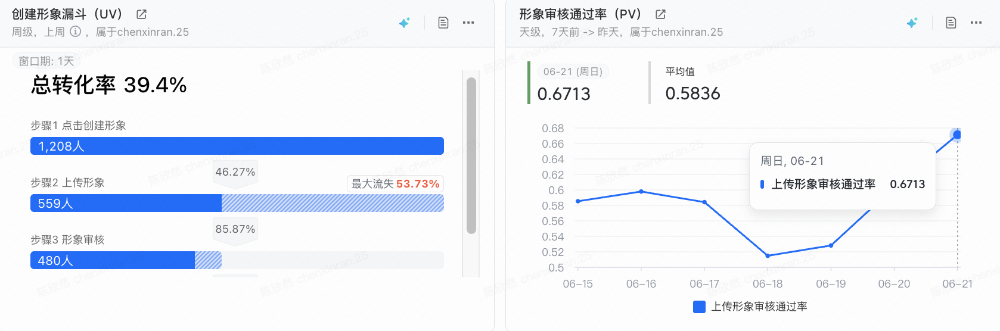
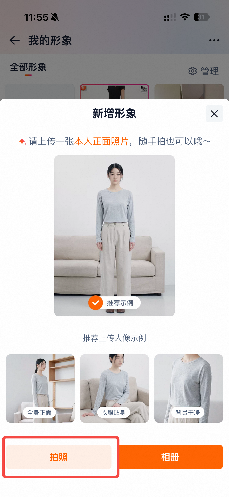
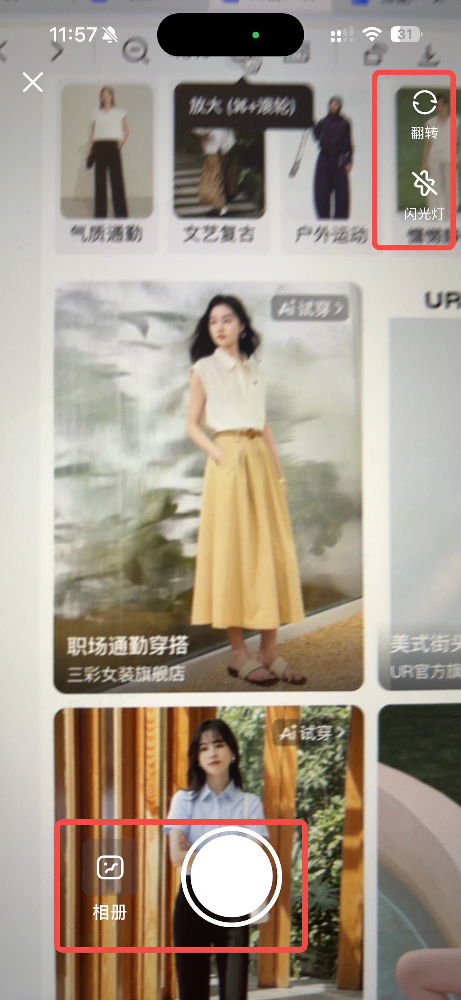
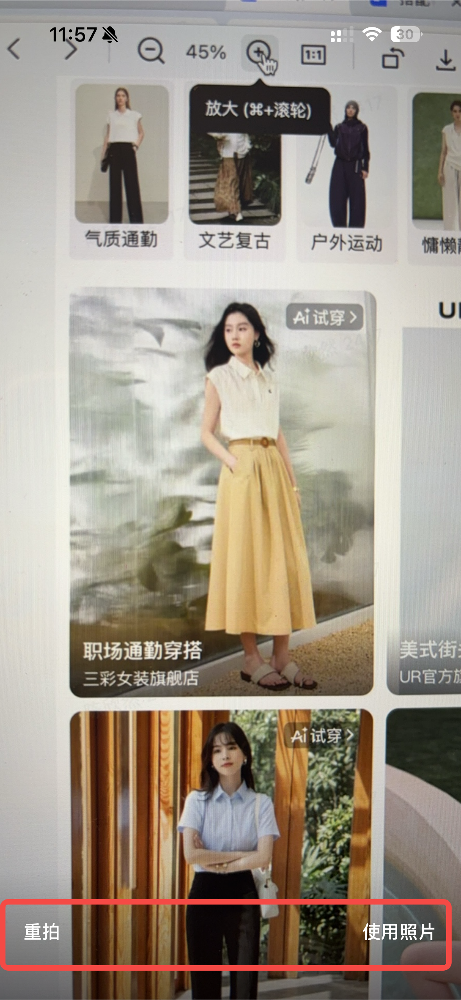
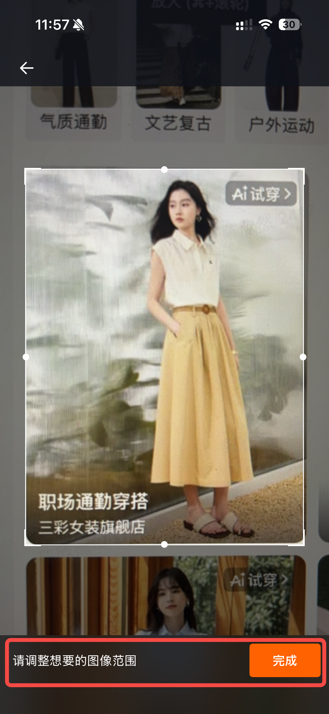
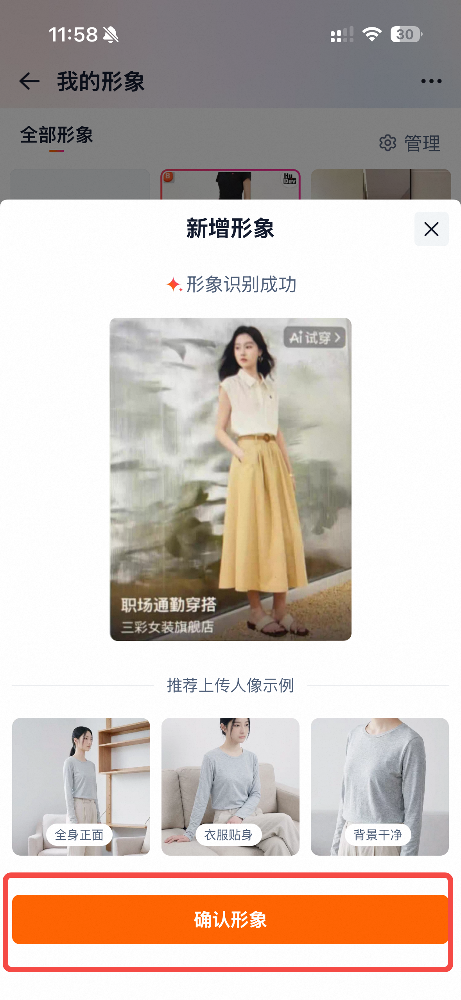

<title>AI试穿-新增拍照输入PRD 副本test</title>

# 需求背景

## 仅支持相册上传让没有合格照片的用户流失

<grid>
<column width-ratio="0.500000">
**实验数据显示**
1. **超半数用户卡在图片上传环节：**
> 近 7 日「点击创建形象」共 1208 人，但成功「上传形象」仅 559 人，步骤转化率仅 46.3%，超半数（53.7%）在点击创建后未能完成图片上传就流失。
1. **相册照片质量参差，约四成上传被审核拒绝**
> 上传形象审核通过率 7 日均值仅约 57.7%（单日在 51%–67% 之间波动），意味着大量用户即便从相册选图，也因照片不合格被拦截。
</column>
<column width-ratio="0.500000">
**用户动线分析**
1. **相册中没有符合要求的图片**
> 用户打开相册需要在海量照片中寻找合格照片，较为耗费时间、体验较差；
> 
> 相册中找不到符合要求的单人正脸照片，多人合照、背景存在路人、有一定角度的自拍照等情况更为常见。
1. **点击上传后被清晰度等难以感知的原因拒绝**
> 按要求选择清晰人物照，但不知道照片的清晰度如何，总是被审核驳回，失去耐心，退出界面。
</column>
</grid>

<grid>
<column width-ratio="0.548417">

</column>
<column width-ratio="0.451583">

</column>
</grid>

**上线预期**

**新增「拍照」入口后，可让用户当场获取一张清晰、合规的照片，从源头绕开「相册无合格照片」与「选图被审核拒绝」两道流失关口。** 预期将「点击创建 → 上传成功」步骤转化率从 46.3% 提升至 60% 左右，上传审核通过率从 57.7% 提升至 70% 左右，带动「点击创建 → 试穿成功」整体漏斗转化提升约4成。

## 同行业功能补齐+市场宣传需要新增「拍照」入口

- 同业（淘宝、京东）功能均已支持拍照上传，以下为tb参考。

<grid>
<column width-ratio="0.200000">

</column>
<column width-ratio="0.200000">

</column>
<column width-ratio="0.200000">

</column>
<column width-ratio="0.200000">

</column>
<column width-ratio="0.200000">

</column>
</grid>

- B端市场同学计划将ai虚拟试穿功能在线下进行展示从现场交互体验考量，希望功能可以**支持用户拍照上传**，使用体验更佳。

# 需求详情

<table><colgroup><col/><col/><col/></colgroup><thead><tr><th>功能模块</th><th>描述</th><th></th></tr></thead><tbody><tr><td rowspan="3">用户形象</td><td>录入用户信息</td><td>上传 1 张面部清晰的图片（相册选择） <b>新增：拍照上传</b></td></tr><tr><td rowspan="2">形象管理</td><td>支持 1 个试穿形象</td></tr><tr><td>形象支持删除</td></tr></tbody></table>

**需求详情：**

<table><colgroup><col/><col/><col/></colgroup><thead><tr><th>需求模块</th><th>需求内容</th><th>图示</th></tr></thead><tbody><tr><td>创建形象</td><td>新增拍照上传照片的链路，相册上传复用原链路<ul><li>拍照上传：点击上传图片拉起浮层，支持选择拍照上传的能力</li></ul></td><td><grid><column width-ratio="0.500000"></column><column width-ratio="0.500000"></column></grid></td></tr><tr><td>拍照页</td><td>支持翻转、进入相册、关闭的能力<ul><li>翻转：点击切换前/后摄像头</li><li>进入相册：点击拉起相册列表</li><li>关闭：点击进入创建形象的浮层页面</li></ul></td><td></td></tr><tr><td>拍摄完成</td><td>支持重拍、确认图片的能力<ul><li>重拍：回到拍照页面，保留此前选择的摄像头（正/反）</li><li>使用图片：点击后进入图片审核</li></ul></td><td></td></tr><tr><td>上传结果</td><td>审核用户的拍照图片质量 点击重新上传：拉起浮层，让用户选择拍照/从相册选择</td><td><grid><column width-ratio="0.500000"></column><column width-ratio="0.500000"></column></grid></td></tr></tbody></table>

# 需求节奏

市场侧活动7月中旬要完成产品功能测试，因此该需求需在7月中旬前完成上线。

# 实验

不开实验，看形象创建率即可