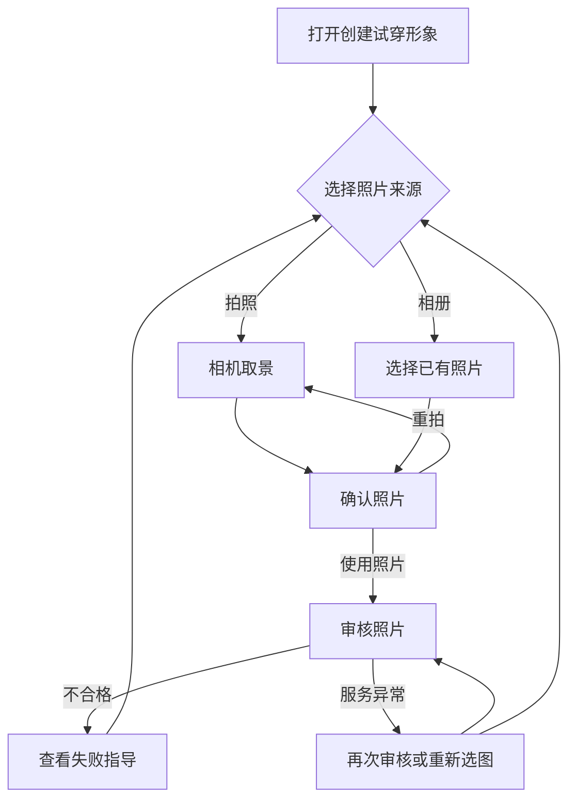

# AI 试穿形象拍照上传

## 1. 背景与目标

近 7 日有 1,208 人点击创建形象，仅 559 人完成上传，上传步骤转化率为 46.3%；已上传照片的审核通过率约为 57.7%。用户常因相册里没有合格的单人正脸照片，或无法提前判断清晰度而放弃。

本次增加现场拍照入口，让用户在创建形象时直接获得符合要求的照片。目标是把点击创建到上传成功的转化率提升至约 60%，把上传审核通过率提升至约 70%。

## 2. 产品逻辑

用户打开照片来源后，可选择拍照或从相册选择。拍照路径提供翻转摄像头、进入相册和关闭能力；完成拍摄后，用户可重拍或使用照片。系统审核照片质量，并在照片不合格或审核服务异常时提供可恢复操作。

## 3. 功能清单

| 功能 | 说明 |
|------|------|
| 选择照片来源 | 提供拍照和相册两个入口 |
| 拍摄照片 | 支持翻转摄像头、打开相册、关闭和快门 |
| 确认照片 | 支持重拍或提交审核，重拍保留摄像头方向 |
| 审核照片 | 展示审核过程和不合格原因 |
| 恢复异常 | 审核超时时支持再次审核或重新选择照片 |

## 4. 功能描述

### 4.1 选择照片来源

- 用户点击上传照片后，看到拍照和从相册选择两个入口。
- 选择拍照后进入相机取景；选择相册后打开最近照片，并在选中照片后进入确认。
- 用户从相机关闭时回到来源选择，创建形象内容继续保留。

### 4.2 拍摄照片

- 相机取景
  - 用户可切换前后摄像头，界面明确反馈当前方向。
  - 用户可打开相册，并从相册取消返回相机。
  - 用户点击快门后进入照片确认。
- 照片确认
  - 用户选择重拍后返回相机，并保留此前摄像头方向。
  - 用户选择使用照片后进入审核等待状态。

### 4.3 审核与恢复

| 状态 | 用户看到什么 | 可执行操作 |
|------|--------------|------------|
| 审核中 | 正在检查清晰度、正脸与单人画面 | 等待结果 |
| 照片不合格 | 失败原因和正脸、无遮挡、单人指导 | 重新上传 |
| 审核服务异常 | 照片已保留、服务暂不可用 | 再次审核或重新选图 |

重新上传会返回照片来源选择，使用户能切换拍照或相册，不把用户困在失败页面。

## 5. 验收标准

| 场景 | 预期 |
|------|------|
| 打开上传入口 | 同时看到拍照和相册选择 |
| 切换摄像头后重拍 | 返回相机并保留摄像头方向 |
| 从相机进入相册 | 最近照片可选，取消后返回相机 |
| 关闭相机 | 返回照片来源选择 |
| 使用照片 | 先显示审核中，再显示审核结果 |
| 照片审核失败 | 显示原因、合规指导和重新上传入口 |
| 审核服务异常 | 照片保留，可再次审核或重新选图 |

## 6. 埋点方案

| 事件 | 触发时机 | 用于回答的问题 |
|------|----------|----------------|
| 选择照片来源 | 用户选择拍照或相册 | 两类来源的使用比例 |
| 拍照流程操作 | 翻转、快门、重拍、关闭 | 用户卡在哪一步 |
| 照片审核结果 | 审核成功、失败或服务异常 | 审核通过率与失败原因 |
| 重新上传 | 用户从失败页重试 | 失败后的恢复率 |

## 7. 附件

- 可点击原型：`canvas/pages/01-camera-upload.html`
- 浏览器验收截图：`snapshots/`
