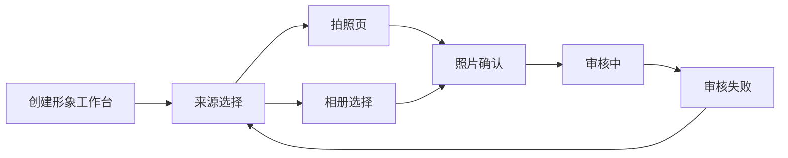
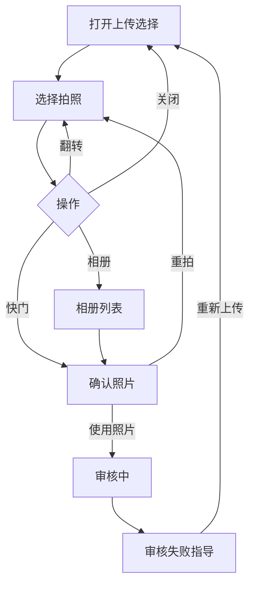

# AI 试穿拍照上传原型规格

## 1. 设计概要

- **设计方向**：火山控制台（VNE 固定预设）
- **设计系统**：`@cloud-materials/common` + `@cloud-materials/charts-common`
- **设计 Token**：

| Token | 值 | 说明 |
|---|---|---|
| 主色 | `#165DFF` | 主操作、选中态 |
| 成功色 | `#00B42A` | 审核通过提示 |
| 错误色 | `#F53F3F` | 审核失败提示 |
| 圆角 | `4px / 12px` | 控制台组件 / 移动预览容器，后者来自现有截图校准 |
| 间距 | `4/8/12/16/20/24px` | 火山源力间距 |
| 字体 | `14/16/18px` | 正文 / 分组标题 / 页标题 |

### 视觉参考来源

| 来源 | 类型 | 影响范围 | 说明 |
|---|---|---|---|
| image-001～002 | 数据截图 | 需求依据 | 只用于说明上传流失与拒绝原因，不作为 UI 复刻素材 |
| image-003～007 | 竞品截图 | 交互参考 | 参考拍照/相册双入口、重拍和确认动作 |
| image-008～013 | 现有系统截图 | 全流程 | 提取创建浮层、相机、确认、审核结果的状态与文案；不直接嵌入整屏截图 |

## 2. 页面清单与导航结构

### 2.1 页面清单

| 页面 | PRD 来源 | 承载方式 | 入口 | 说明 |
|---|---|---|---|---|
| 创建形象工作台 | 创建形象 | ConsoleLayout 主页面 | 侧栏 > 拍照上传 | 展示上传入口和照片要求 |
| 来源选择 | 创建形象-拍照上传 | Modal | 上传 1 张照片 | 拍照/相册双入口 |
| 拍照页 | 拍照页 | 全屏预览态 | 选择拍照 | 翻转、相册、关闭、快门 |
| 照片确认页 | 拍摄完成 | 全屏预览态 | 快门或相册选择 | 重拍、使用照片 |
| 审核状态页 | 上传结果 | 状态面板 | 使用照片 | 加载后展示失败指导，支持重试 |

### 2.2 导航结构

### 2.3 关键用户任务流

## 3. 逐页规格

### 3.1 创建形象工作台与来源选择

#### 布局结构

`CConfigProvider` + `CSideBar` + 右侧自适应内容区；18px 标题独占一行。主内容为照片要求说明、上传卡片和最近任务状态。来源选择使用 Modal，避免嵌套弹窗。

#### 组件清单

| 区域 | 组件类型 | PRD 来源 | 数据/内容 | 交互行为 | 状态覆盖 |
|---|---|---|---|---|---|
| 标题 | Typography | 创建形象 | AI 试穿形象 | 只读 | 默认 |
| 主内容 | Card + Upload | 录入用户信息 | 上传 1 张面部清晰图片 | 点击 → 打开来源 Modal | 默认/禁用 |
| 来源 Modal | Modal + Button | 创建形象 | 拍照、从相册选择 | 点击 → 对应预览态 | 默认/加载/禁用 |

#### 关键交互说明

- 点击上传卡片 → 打开来源 Modal → 首个焦点落在“拍照” → Esc 关闭。
- 点击拍照 → 关闭 Modal 并进入拍照页 → 显示当前后置摄像头状态。
- 点击相册 → 打开相册选择态 → 选择缩略图后进入照片确认。

#### 焦点与键盘导航

- Tab 顺序：上传卡片 → 来源动作；Modal 关闭后焦点回上传卡片。

#### 联动规则

- 协议确认状态变化 → 上传入口启用/禁用（推断，待确认；原需求截图含协议控件）。

#### 响应式行为

| 断点 | 布局变化 | 组件适配 |
|---|---|---|
| >= 1024px | 侧栏展开，说明与预览双列 | Modal 居中 |
| 768–1023px | 侧栏折叠，内容单列 | 预览宽度自适应 |
| < 768px | 隐藏侧栏 | 预览占满内容区 |

#### 边界与内容规则

- 无相册照片时显示 Empty；相机无权限时显示 Alert 与重试入口。

### 3.2 拍照与照片确认

#### 布局结构

深色相机预览区，上方关闭/翻转，下方相册/快门；确认态保留图像并在底部提供重拍和使用照片。

#### 组件清单

| 区域 | 组件类型 | PRD 来源 | 数据/内容 | 交互行为 | 状态覆盖 |
|---|---|---|---|---|---|
| 相机工具 | Button | 拍照页 | 关闭、翻转 | 点击 → 返回来源/切换 facing | 默认/禁用 |
| 相机底栏 | Button | 拍照页 | 相册、快门 | 点击 → 相册/确认 | 默认/禁用 |
| 确认底栏 | Button | 拍摄完成 | 重拍、使用照片 | 点击 → 相机/审核 | 默认/加载/禁用 |

#### 关键交互说明

- 点击翻转 → `back/front` 状态切换 → 状态标签更新。
- 点击重拍 → 返回拍照页 → 保留上次 facing。
- 点击使用照片 → 进入审核中 → 900ms 后展示失败指导（原型确定性模拟）。

#### 焦点与键盘导航

- Tab 顺序：关闭 → 翻转 → 相册 → 快门；确认态为重拍 → 使用照片。

#### 联动规则

- facing 变化 → 重拍后继续使用同一 facing。

#### 响应式行为

| 断点 | 布局变化 | 组件适配 |
|---|---|---|
| >= 768px | 预览与说明并排 | 相机画布最大宽 420px |
| < 768px | 预览独占 | 操作固定底部 |

#### 边界与内容规则

- 权限拒绝、设备无相机、相册为空分别使用 Alert/Empty，不伪装成功。

### 3.3 审核状态页

#### 布局结构

审核中使用 Spin；失败使用 Result + 原因 Alert + 三条合格照片提示 + 重新上传主按钮。

#### 组件清单

| 区域 | 组件类型 | PRD 来源 | 数据/内容 | 交互行为 | 状态覆盖 |
|---|---|---|---|---|---|
| 审核中 | Spin | 上传结果 | 正在审核照片 | 自动进入失败模拟 | 加载中 |
| 审核失败 | Result + Alert | 上传结果 | 照片内容不符合规范 | 展示重试 | 错误 |
| 恢复动作 | Button | 点击重新上传 | 重新上传 | 点击 → 来源 Modal | 默认/禁用 |

#### 关键交互说明

- 审核失败点击重新上传 → 清空当前照片 → 打开来源 Modal → 焦点落拍照按钮。

#### 焦点与键盘导航

- 状态切换后使用 `aria-live` 宣告；失败态焦点移至标题，Tab 到重新上传。

#### 联动规则

- 审核结果 → 控制失败原因和完成按钮可用性。

#### 响应式行为

| 断点 | 布局变化 | 组件适配 |
|---|---|---|
| 全部 | 状态内容居中 | 文案最大宽 520px |

#### 边界与内容规则

- 失败原因最多两行；超长原因截断并提供 Tooltip。

## 4. 全局组件规格

| 全局组件 | 规格 | 说明 |
|---|---|---|
| 控制台壳层 | `CConfigProvider` + `CSideBar` + flex 内容区 | standard shell |
| 页面标题区 | 18px 单独一行 | 工具行位于下一行 |
| 来源选择 | Modal | 无弹窗套弹窗 |
| 状态反馈 | Spin / Result / Alert / Empty | 覆盖等待、失败、权限与空态 |

## 5. 状态矩阵

| 页面 | 默认 | 加载中 | 空数据 | 错误 | 无权限 |
|---|---|---|---|---|---|
| 创建形象 | 上传入口 | N/A | N/A | 上传服务失败 Alert | N/A |
| 来源选择 | 两个来源 | 相册加载 | 相册 Empty | 相册读取失败 | 相机权限提示 |
| 拍照页 | 相机预览 | 相机启动 | N/A | 设备不可用 | 权限拒绝 |
| 照片确认 | 照片预览 | 图像处理 | N/A | 图像解析失败 | N/A |
| 审核状态 | 结果展示 | Spin | N/A | 失败指导 | N/A |

## 6. 待确认项

| 编号 | 页面/组件 | 待确认内容 | 当前假设 | 来源 |
|---|---|---|---|---|
| 1 | 创建形象 | 是否必须先勾选协议 | 必须勾选后才能上传 | 推断（截图包含协议，PRD 未明确） |
| 2 | 审核 | 是否存在成功态 | 本实验只实现合同要求的失败链路 | 推断（合同固定任务） |

## 7. 可编辑绑定（Proto Edit）

| key | type | label | 默认值 | 页面 | PRD/规格来源 |
|---|---|---|---|---|---|
| page.title | text | 页标题 | AI 试穿形象 | 创建形象 | 创建形象 |
| upload.cta | text | 上传按钮 | 上传 1 张照片 | 创建形象 | 录入用户信息 |
| review.failureTitle | text | 失败标题 | 照片暂时无法使用 | 审核状态 | 上传结果 |
| token.primary | token | 主色 | #165DFF | 全局 | 设计概要 |

## 8. 变更记录

| 版本 | 日期 | 变更内容 |
|---|---|---|
| v1.0 | 2026-07-13 | 初始 VNE Path B 规格 |

## 9. 研发交付映射

不适用（非 Path E）。
