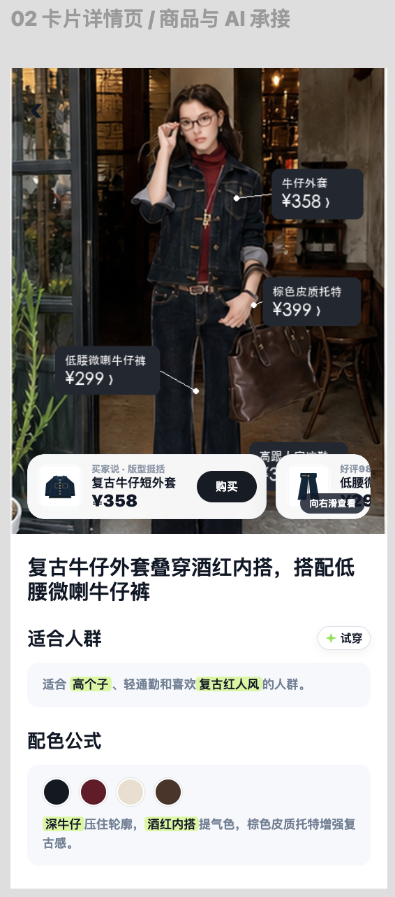
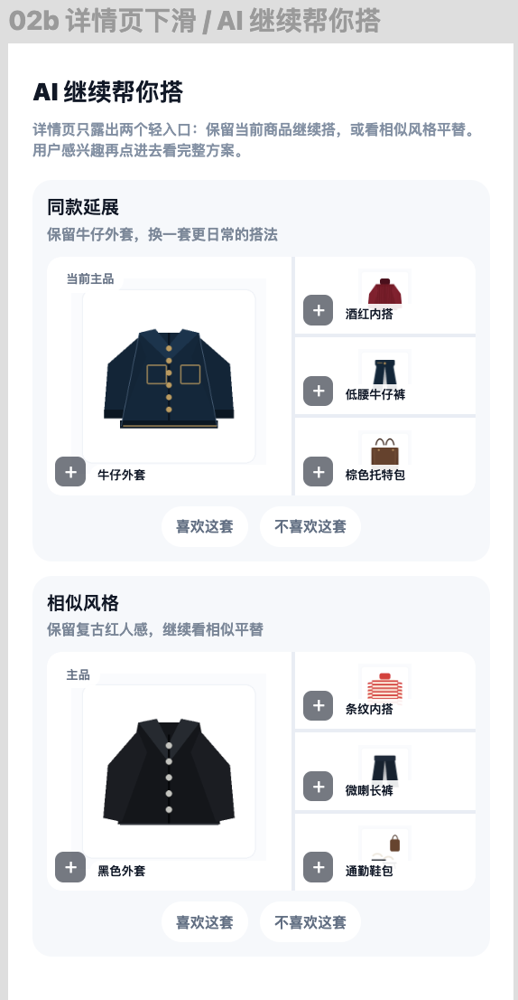
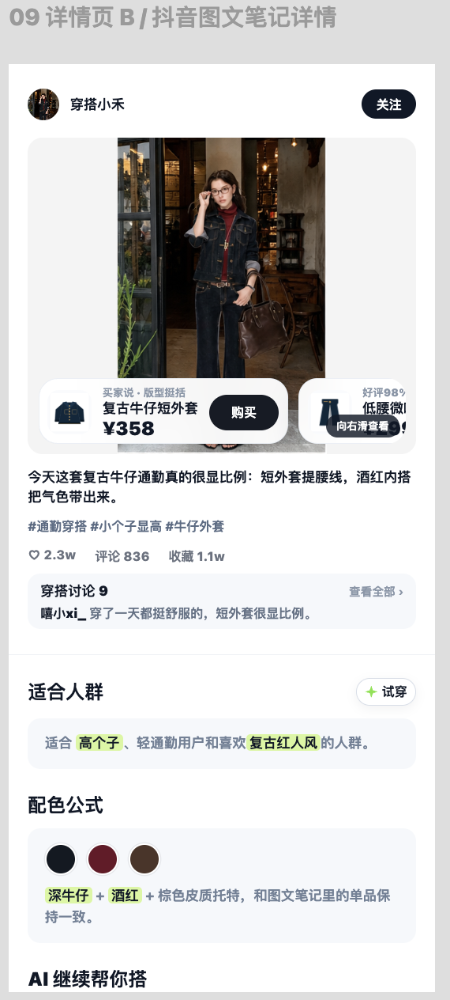
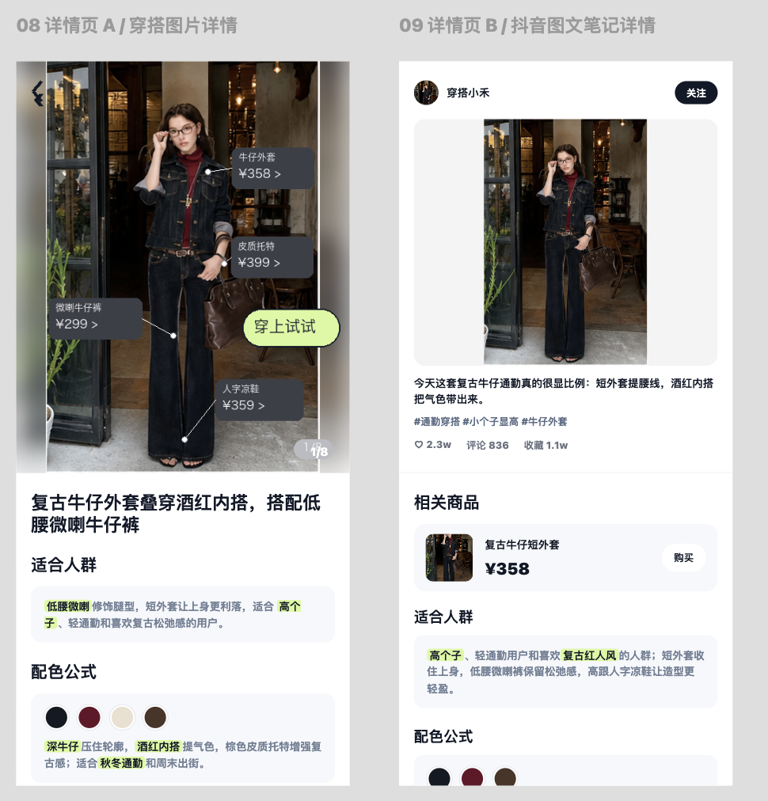
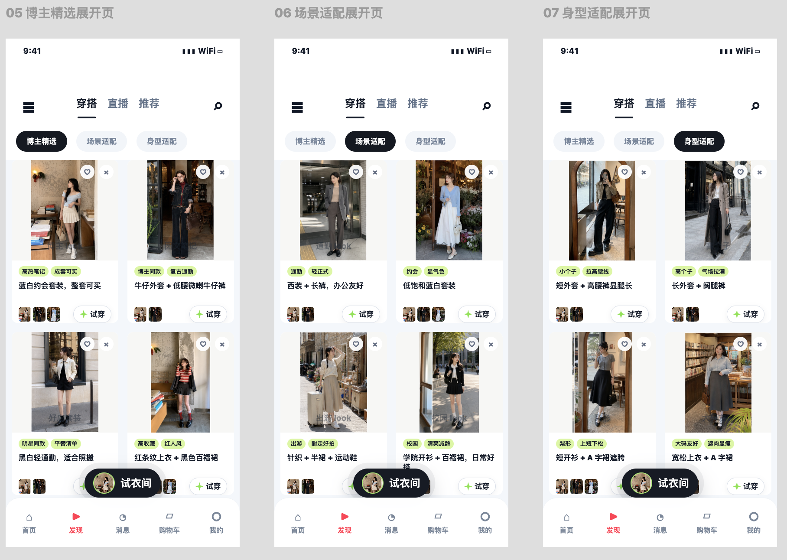

# 穿搭Tab - 迭代方案

## 市场调研

用户最关注：什么场合穿什么、自己适合穿什么、有没有商品链接能直接买

下拆场合：日常、通勤、出游 为top3需求

下拆个人：风格、身型、肤色 为top3需求

<readonly-block href="https://bytedance.aiforce.cloud/app/app_179da2ak1dn/" type="iframe"></readonly-block>

## 竞品分析

**对标行业：搭配供给仍是基础，可逛性、个性化、内容背书要补齐**

<table><colgroup><col/><col/><col/><col/><col/></colgroup><thead><tr><th>平台</th><th>逛穿搭</th><th>成套商品承接</th><th>穿搭页</th><th>一句话总结</th></tr></thead><tbody><tr><td>淘宝</td><td>✅ 供给厚、审美高 ✅ 价格优惠（穿搭券）</td><td>✅ 推荐相似穿搭</td><td><grid><column width-ratio="0.500000"></column><column width-ratio="0.500000"></column></grid></td><td><b>货架端标杆</b>：穿搭券撬动商家自发供给，人群/场景分 tab、可点同款、AI 成套搭配均已跑通，是当前行业最完整解； 对独立端更多是"对标补齐"，纯货架逻辑下差异化空间有限。</td></tr><tr><td>小红书</td><td>✅ 卡+笔记混排 ✅ 种草背书强（笔记种草）</td><td>❌ 弱 偏向单品种草</td><td><grid><column width-ratio="0.500000"></column><column width-ratio="0.500000"></column></grid></td><td><b>内容端可逛性天花板</b>：卡+笔记混排、笔记下方带可点单品链接，"逛→种草→买"链路完整； 对独立端更多是<b>内容组织与种草可逛性</b>的对标标杆，而非成交承接层——要补的正是它这种个性化、有背书的内容逛感。</td></tr><tr><td>得物</td><td>✅ 种草可信度强（素人种草）</td><td>❌ 弱 偏向单品种草</td><td><grid><column width-ratio="0.500000"></column><column width-ratio="0.500000"></column></grid></td><td><b>潮流种草社区</b>：正品+潮流社区定位、图文笔记带商品链接，真人实穿分享带来较强种草背书。</td></tr><tr><td>独立端穿搭</td><td>🟡 缺个性/背书</td><td>🟡 缺所见即所得、价格带约束</td><td><grid><column width-ratio="0.500000"></column><column width-ratio="0.500000"></column></grid></td><td><b>硬件已补齐</b>：搭配供给到位、且独有穿搭页承接；但内容不个性化、缺人群/场景组织、无背书，等于"有货架、品不多、没导购"，逛不起来也留不住人。</td></tr></tbody></table>

## 方向判断

<callout emoji="🎄">
**一期结论：**穿搭 tab 能引进年轻女性，却没留住——人均停留仅 22 秒、主动点击率 2.8%，核心问题是内容吸引度不足。  
**迭代方向：** “场景 + 个人+博主推荐”组织 feed → 详情页讲清适合人群、配色审美 →AI 同款搭配 / 平替 / 单品清单承接
</callout>

**需求侧｜用户来到穿搭 Tab，本质只问三件事：**

<grid>
<column width-ratio="0.330000">
**我该穿什么**  
场景：通勤、出游、约会、校园。  
依据：场景任务高频（日常 312、通勤 302）。  
承接：场景分类 + 整套搭配。
</column>
<column width-ratio="0.330000">
**这套适合我吗**  
条件：小个子、微胖、梨形、黄黑皮。  
依据：个人适配信号最高（560）、避雷热度 8771。  
承接：适配理由 + 避雷说明。
</column>
<column width-ratio="0.340000">
**我怎么买到**  
诉求：图几同款、平替、价格、尺码。  
依据：评论反复求链接、同款（70）、单品（74）。  
承接：商品清单 + 同款 / 平替。
</column>
</grid>

**供给侧｜解决两个矛盾：好看的搭配要能买到，商城的货要能配出好搭配。**

<grid>
<column width-ratio="0.500000">
**有图无品**：博主 / 明星 / 模特图好看，但缺商品链接。  
→ 种草图文+商品链接；无商品，用图搜召回同款平替。
</column>
<column width-ratio="0.500000">
**有品无图**：商城有货，但缺搭配内容。  
→ 用直播 / 视频搭配关系 ；AIGC 补图。
</column>
</grid>

## 产品方案

**顺着上面的三件事与供给矛盾，产品方案收敛为 4 个模块：tab二级分类、外流卡片展示、详情页内容丰富、商品/AI 承接。**

<grid>
<column width-ratio="0.095964">

</column>
<column width-ratio="0.161585">

</column>
<column width-ratio="0.161585">

</column>
<column width-ratio="0.281741">

</column>
<column width-ratio="0.299124">

</column>
</grid>

<table><colgroup><col/><col/><col/><col/></colgroup><thead><tr><th>模块</th><th>要做什么</th><th>为什么做</th><th>一期验收</th></tr></thead><tbody><tr><td>二级tab分类</td><td>场景：日常、通勤、出游； 条件：身高、体型、肤色。 博主推荐：利用好抖音内容优势</td><td>解决用户问题- <b>我该穿什么 </b></td><td>3 个场景 + 3 个条件分类</td></tr><tr><td>外流卡片</td><td>首屏给一句话理由：适用场合 + 适合谁 + 解决什么 支持用户点击like/dislike，强化/减少类似推荐</td><td>解决用户问题- <b>这套适合我吗 </b><blockquote>
当前人均停留仅 22 秒、主动点击率 2.8%，内容吸引度不足，需降低点击判断成本
</blockquote></td><td>每张卡有明确理由和商品入口</td></tr><tr><td>卡片详情页</td><td>放适配理由、配色/比例公式、避雷点、尺码面料提醒；内嵌 AI 搭配与 AI 试穿触点</td><td>解决用户问题- <b>这套适合我吗 </b><blockquote>
把"展示搭配"变成"解释为什么适合我"，并就地承接试穿；当前进入穿搭 tab 后不足 2% 用户点击试穿，需把试穿前置到搭配内容里就地承接
</blockquote></td><td>覆盖适配、公式、避雷、商品清单、试穿入口</td></tr><tr><td>承接</td><td>商品清单、图几同款、平替；AI 搭配、相似穿搭、AI 试穿</td><td>解决用户问题- <b>我怎么买到</b><blockquote>
用户看到搭配后最直接的问题是"怎么买"和"我穿会怎样"
</blockquote></td><td>可点商品；无同款时有平替；AI 搭配 pctr 不低于当前 0.86%</td></tr></tbody></table>

### 核心指标

**分期按“先点进来 → 再看明白 → 最后个性化”推进。**

| 阶段 | 重点 | 为什么 | 指标 |
|-|-|-|-|
| P0 点击与逛场 | 场景/条件分类 + 理由型卡片 + 商品入口。 | 先验证用户是否愿意点进来、继续逛。 | 浏览时长、卡片点击率、商品点击率。 |
| P1 详情页决策 | 适配解释、搭配公式（配色、ai搭配）、单品清单。 | 解决“适不适合我、会不会翻车、在哪里买”。 | 详情页停留、商品清单点击、收藏/加购。 |
| P2 AI 个性化 | AI 搭配、相似穿搭、AI 试穿、~~风格测试~~。 | 等有行为和供给标签后，再做个人顾问。 | AI 点击率、二跳时长、复访率。 |