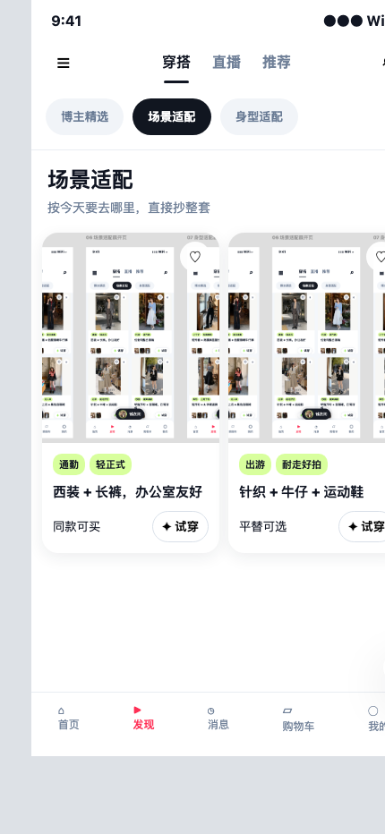
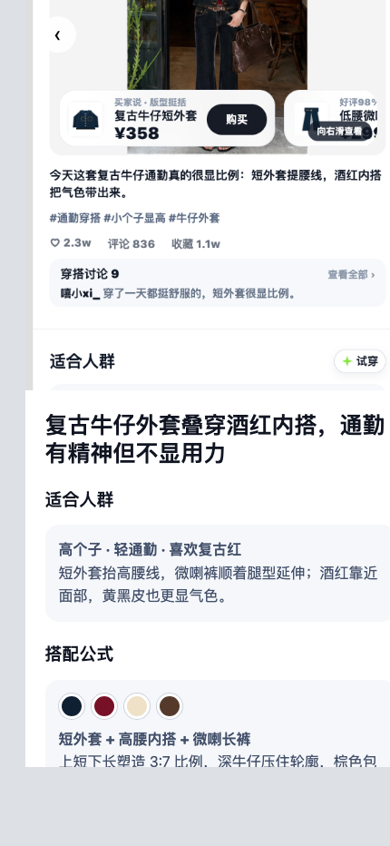
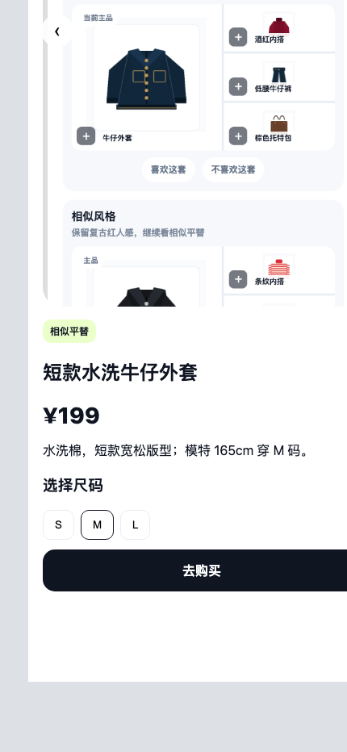
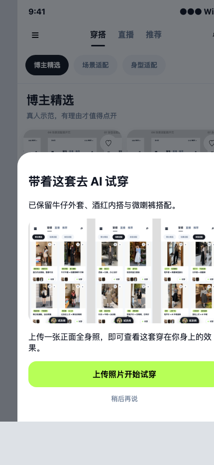

# 穿搭 Tab 决策型内容升级

## 1. 背景与问题

年轻女性进入穿搭 Tab 后，本质上要回答三件事：今天该穿什么、这套是否适合自己、如何买到。当前内容缺少场景与个人条件组织，也没有把理由、商品和试穿串成连续路径；人均停留仅 22 秒，主动点击率 2.8%。

## 2. 目标与边界

本期用二级分类降低找内容的成本，用理由型卡片降低点击判断成本，用解释型详情和商品/AI 承接完成决策。不做风格测试、全局导航重构、交易结算和相机采集流程。

## 3. 产品逻辑

用户进入穿搭频道 → 切换博主/场景/身型分类 → 点击理由型卡片 → 阅读适合人群、搭配公式、避雷提醒 → 查看同款或平替 → 保留当前商品继续搭或进入 AI 试穿。

本地伴生画布入口：[`canvas/pages/01-outfit.html`](canvas/pages/01-outfit.html)

## 4. 功能清单

### 4.1 二级分类与信息流

- 提供博主精选、场景适配、身型适配；切换后选中态、标题、理由与卡片同时更新。
- 场景覆盖日常、通勤、出游；条件覆盖身高、体型、肤色。
- 加载中显示进度反馈；空结果可返回推荐；失败保留分类并可重试。

### 4.2 理由型卡片

- 首屏说明适用场合、适合谁、解决什么中的至少两项。
- 喜欢会强化相似推荐；不喜欢会减少相似推荐；两种反馈均即时确认。
- 点击卡片进入完整解释。

### 4.3 解释型详情

- 按适合人群、搭配公式、避雷提醒、商品清单、AI 承接排列。
- 适配说明条件与原因；公式说明颜色、比例或材质；避雷给出不适合条件及调整建议。

### 4.4 商品与平替

- 同款和平替必须明确标识，展示价格、材质与尺码。
- 无同款时展示相似风格平替，不伪装成同款。
- 尺码可选择；购买动作进入可见确认状态，返回后保留选择。

### 4.5 AI 搭配与试穿

- “保留当前商品继续搭”进入延展搭配状态；“AI 试穿”携带当前搭配进入上传状态。
- 上传后必须进入可见的照片审核准备态，并支持返回。

## 5. 异常与边界状态

- 首次无偏好时默认博主精选，不假装已个性化。
- 加载、空、失败是独立可操作状态；失败重试回到当前分类。
- 商品失效时隐藏购买并引导平替；价格以打开商品时为准。

## 6. 埋点判断

需要埋点。记录分类曝光/切换、理由卡曝光/点击、喜欢/不喜欢、详情各模块到达、同款/平替点击、尺码选择、购买点击、继续搭、AI 试穿、上传开始及失败重试。核心漏斗为分类曝光 → 卡片点击 → 详情关键内容到达 → 商品或 AI 点击。

## 7. 验收标准

- 五条固定任务均可从同一入口连续点击完成。
- 分类内容发生可见变化；详情三类指导完整；商品信息和 AI 入口状态可见。
- 无控制台异常、页面异常、断链、孤岛页或假交互。

## 8. 附件

- 伴生画布：`canvas/pages/01-outfit.html`
- 设计 token：`canvas/tokens.css`
- 设计模式：`canvas/patterns.md`
- QA 截图：`snapshots/`
- 审查记录：`reviews/`

