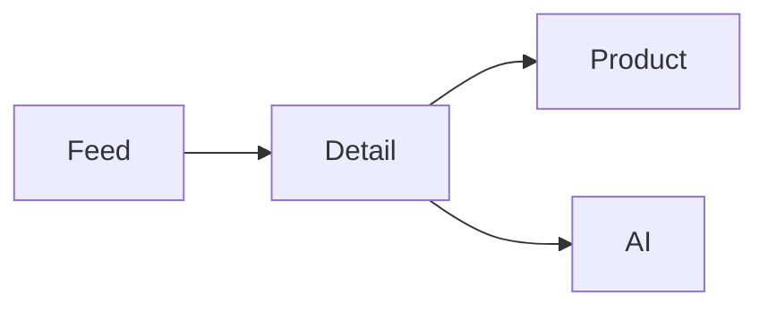

# 穿搭 Tab 原型规格

## 1. 设计概要

- **设计方向**：火山控制台（Skill 固定预设；依据 Path A 移动视觉稿做移动端微调）
- **设计系统**：`@cloud-materials/common` + `@cloud-materials/charts-common`

| Token | 值 | 说明 |
|---|---|---|
| 主色 | #141821 | 视觉稿黑色主操作 |
| 强调色 | #C9FF72 | 人群/理由标签 |
| 圆角 | 12px | 移动卡片 |
| 间距 | 4/8/12/16/20/24px | 火山源力基准 |

### 视觉参考来源

| 来源 | 类型 | 影响范围 | 说明 |
|---|---|---|---|
| 图 1-8 | 竞品/现状截图 | 内容组织 | 卡片、笔记与购买承接参考 |
| 图 9-12 | 功能视觉稿 | 详情页 | 适合人群、公式、商品、AI 入口 |
| 图 13 | 功能视觉稿 | Feed | 二级分类、理由型双列卡片 |

## 2. 页面清单与导航结构

| 页面 | PRD 来源 | 承载方式 | 入口 | 说明 |
|---|---|---|---|---|
| 穿搭 Feed | 二级tab分类/外流卡片 | 移动双列卡片 | 穿搭 Tab | 三类切换与反馈 |
| 穿搭详情 | 卡片详情页 | 全屏 Drawer | 点击卡片 | 适配、公式、避雷 |
| 商品信息 | 承接 | Modal | 同款/平替 | 价格尺码可见 |
| AI 搭配/试穿 | 承接 | Modal | 详情操作 | 同款延展与试穿 |

## 3. 逐页规格

### 3.1 穿搭 Feed

布局为顶部频道、三个二级 Tabs、理由型双列 Card Feed。Tabs 切换立即替换内容；点击卡片打开详情；喜欢/不喜欢给出反馈。

| 区域 | 组件类型 | PRD 来源 | 数据/内容 | 交互行为 | 状态覆盖 |
|---|---|---|---|---|---|
| 二级分类 | Tabs | 二级tab分类 | 博主精选/场景适配/身型适配 | 点击→Feed 更新→选中反馈 | default/disabled |
| Feed | Card | 外流卡片 | 场景、人群、理由 | 点击→详情 | loading/empty/error/default |
| 反馈 | Button | like/dislike | 喜欢/不喜欢 | 点击→偏好反馈→Message | default/disabled |

### 3.2 穿搭详情与承接

全屏 Drawer 依次展示大图、适合人群、配色公式、避雷提醒和商品/AI 操作；同款/平替打开商品 Modal，AI 试穿打开 AI Modal。打开后焦点进入浮层，Esc 关闭并回到触发卡片。小于 390px Feed 改单列。

## 4. 全局组件规格

| 全局组件 | 规格 | 说明 |
|---|---|---|
| CConfigProvider | 根主题壳 | scaffold 保留 |
| Card Feed | 移动双列/窄屏单列 | 视觉稿驱动 |
| Modal/Drawer | 有关闭与焦点返回 | 禁止嵌套 |

## 5. 状态矩阵

| 页面 | 默认 | 加载中 | 空数据 | 错误 | 无权限 |
|---|---|---|---|---|---|
| Feed | 卡片展示 | Skeleton（规格态） | Empty（规格态） | Alert+重试（规格态） | Alert |
| 详情 | 解释完整 | 图片占位 | 商品无同款时平替 | 加载失败重试 | 登录提示 |
| AI | 两入口 | Button loading | N/A | 重试 | 登录提示 |

## 6. 待确认项

| 编号 | 页面/组件 | 待确认内容 | 当前假设 | 来源 |
|---|---|---|---|---|
| 1 | Feed | 二级分类是否还需展开到 6 个独立标签 | 先按三组一级分类呈现 | 推断（PRD 未明确交互层级） |
| 2 | 商品 | 实际价格与库存 | 使用视觉稿样例 | 推断（无接口） |

## 7. 可编辑绑定（Proto Edit）

| key | type | label | 默认值 | 页面 | PRD/规格来源 |
|---|---|---|---|---|---|
| page.title | text | 频道标题 | 穿搭 | Feed | 二级tab分类 |

## 8. 变更记录

| 版本 | 日期 | 变更内容 |
|---|---|---|
| v1.0 | 2026-07-13 | 初始 Path A 原型 |

## 9. 研发交付映射

不适用（非 Path E）。
